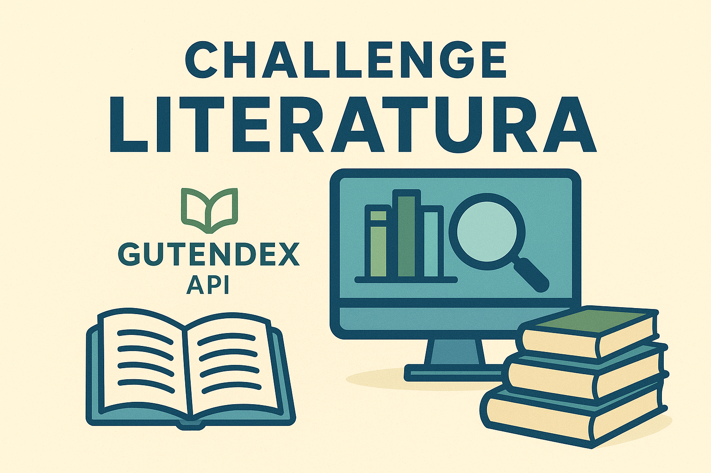

# Challenge Literatura 📚



Aplicación de consola desarrollada en **Java 17** y **Spring Boot 3** que consume la API pública de **Gutendex** para consultar, almacenar y filtrar libros y autores.  
Este proyecto fue creado como parte del **Challenge Literatura**, enfocándose en el consumo de APIs, persistencia con **Spring Data JPA**, y el diseño de menús interactivos en consola.

---

## 🎥 Demostración

[](src/main/resources/20250819-0124-29.9083765.mp4)

---

## 📋 Tabla de Contenidos
- [Características](#-características)
- [Tecnologías](#-tecnologías)
- [Instalación](#-instalación)
- [Uso](#-uso)
- [Estructura del Proyecto](#-estructura-del-proyecto)
- [Contribuir](#-contribuir)
- [Mejoras Futuras](#-mejoras-futuras)
- [Licencia](#-licencia)
- [Contacto](#-contacto)

---

## ✨ Características
- 🔍 **Búsqueda de libros por título** (con resultados parciales, mostrando autores, idiomas y descargas).  
- 📖 **Listado de todos los libros registrados** en la base de datos.  
- 👩‍💻 **Listado de autores** y filtrado de autores vivos en un año específico.  
- 🌎 **Filtrado de libros por idioma**.  
- ⚡ **Carga inicial automática** de 10 libros por idioma desde Gutendex.  

---

## Tecnologías 
- **Java 17**  
- **Spring Boot 3**  
- **Spring Data JPA / Hibernate**  
- **PostgreSQL**  
- **Maven**  
- **Jackson**  
- **Gutendex API**  

---

## ⚙️ Instalación

1. Clonar el repositorio:
   ```bash
   git clone https://github.com/Xn0ch3/Challenge-Literatura.git
   cd Challenge-Literatura
   ```

2. Configurar la base de datos en `application.properties`:
   ```properties
   spring.datasource.url=jdbc:postgresql://localhost:5432/literatura
   spring.datasource.username=tu_usuario
   spring.datasource.password=tu_contraseña
   spring.jpa.hibernate.ddl-auto=update
   ```

3. Compilar y ejecutar:
   ```bash
   mvn clean install
   mvn spring-boot:run
   ```

---

## 🚀 Uso

Al ejecutar la aplicación se muestra un menú interactivo en consola:

```text
--- MENÚ PRINCIPAL ---
1. Buscar libro por título
2. Listar libros registrados
3. Listar autores registrados
4. Listar autores vivos en un año determinado
5. Listar libros por idioma
0. Salir
```

Ejemplo:
- Buscar “pride” → devuelve **Pride and Prejudice – Jane Austen**.  
- Filtrar autores vivos en 1800 → muestra **Jane Austen (1775–1817)**.  

---

## 📂 Estructura del Proyecto
```
src/main/java/…
├─ models
├─ repository
├─ service
└─ principal

src/main/resources
├─ banner.png
└─ demo.mp4
```

---

## 🤝 Contribuir
¡Las contribuciones son bienvenidas! Para colaborar:

1. Haz un fork del repositorio.  
2. Crea una rama (`git checkout -b feature/nueva-funcionalidad`).  
3. Realiza tus cambios y haz commit (`git commit -m 'Agrega nueva funcionalidad'`).  
4. Sube la rama (`git push origin feature/nueva-funcionalidad`).  
5. Abre un Pull Request.  

---

## 🔮 Mejoras Futuras
- [ ] Implementar interfaz web (Thymeleaf o React).  
- [ ] Paginación y búsqueda avanzada.  
- [ ] Pruebas unitarias y de integración.  
- [ ] Despliegue en la nube (Heroku/AWS).  
- [ ] Mejor manejo de errores y logging.  

---

## 📜 Licencia
Este proyecto está bajo la licencia **MIT**. Consulta el archivo [LICENSE](LICENSE) para más información.

---

## 📬 Contacto
👤 **Xn0ch3**  
- GitHub: [@Xn0ch3](https://github.com/Xn0ch3)  
- LinkedIn: [https://www.linkedin.com/in/xavier-nochelli/]  
- Email: XavierNochelli@Gmail.com  


